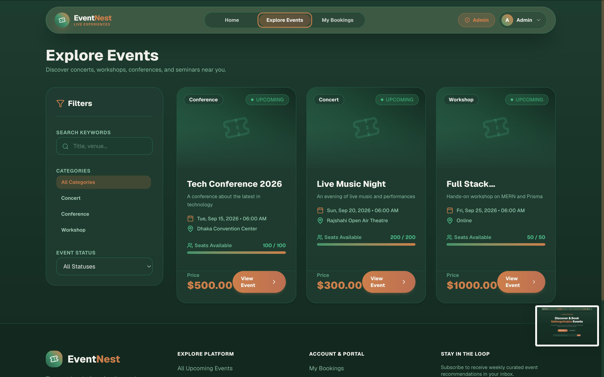
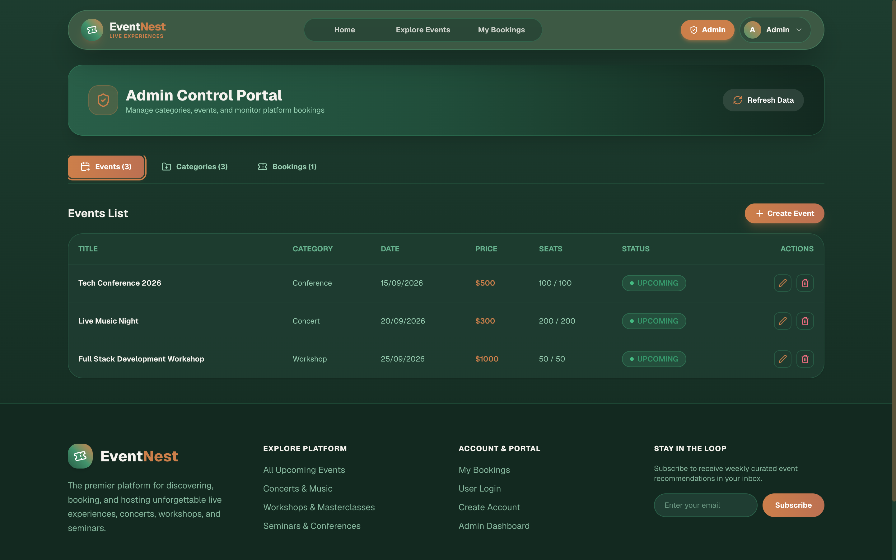

# EventNest — Client (Frontend)

EventNest এর ফ্রন্টএন্ড অ্যাপ্লিকেশন — একটি Event Booking Platform যেখানে ব্যবহারকারীরা ইভেন্ট ব্রাউজ করতে, বুক করতে, এবং নিজেদের বুকিং হিস্ট্রি ম্যানেজ করতে পারেন। Admin দের জন্য রয়েছে আলাদা প্যানেল যেখান থেকে Event ও Category ম্যানেজ করা যায়।

**🔗 Live Site:** [https://eventnest-client-brown.vercel.app](https://eventnest-client-brown.vercel.app)
**🔗 Backend Repo:** [eventnest-server](https://github.com/azizul-dev/eventnest-server)

---

## 📸 Screenshots

| Homepage | Events Page | Dashboard |
|---|---|---|
|  |  |  |

---

## 🛠️ Tech Stack

- **Framework:** Next.js 16 (App Router, Turbopack)
- **UI Library:** React 19
- **Language:** TypeScript
- **Styling:** Tailwind CSS 4
- **Form Handling:** React Hook Form + Zod (validation)
- **HTTP Client:** Axios (with interceptors for JWT auto-attach & error normalization)
- **Animation:** Framer Motion
- **Notifications:** Sonner (toast notifications)
- **Icons:** Lucide React
- **State Management:** React Context API (Auth, Theme)

---

## ✨ Features

- 🔐 **Authentication** — Register, Login, JWT-based session persistence (localStorage)
- 🎟️ **Event Browsing** — Paginated event listing with search, category filter, status filter, and date range filter
- 📄 **Event Details** — Full event info page with booking option
- 🎫 **Booking System** — Book seats, view booking history, cancel bookings
- 👤 **User Dashboard** — Manage profile, view personal bookings
- 🛡️ **Admin Panel** — Create/update/soft-delete events and categories (Role-based access)
- 🌗 **Theme Support** — Light/Dark mode via ThemeContext
- 📱 **Responsive Design** — Fully responsive across devices
- ⚡ **Optimistic Loading States** — Skeleton loaders for better UX

---

## 📁 Project Structure

```
src/
├── app/                  # Next.js App Router pages
│   ├── admin/            # Admin panel
│   ├── dashboard/        # User dashboard
│   ├── events/           # Events listing & [id] detail page
│   ├── login/            # Login page
│   ├── register/         # Register page
│   └── layout.tsx        # Root layout
├── components/
│   ├── ui/               # Reusable UI components (Button, Badge, Modal, Skeleton)
│   ├── layout/            # Navbar, Footer
│   └── events/            # EventCard, etc.
├── context/
│   ├── AuthContext.tsx    # Auth state, login/register/logout logic
│   └── ThemeContext.tsx   # Theme toggle logic
├── hooks/
│   ├── useAuth.ts
│   ├── useEvents.ts
│   ├── useBookings.ts
│   └── useCategories.ts
├── lib/
│   └── api.ts             # Centralized Axios instance with interceptors
└── types/
    └── index.ts            # Shared TypeScript types
```

---

## ⚙️ Environment Variables

`.env.local` ফাইলে নিচের ভ্যারিয়েবলটি সেট করতে হবে:

```env
NEXT_PUBLIC_API_URL=http://localhost:8000/api
```

Production (Vercel) এ deploy করার সময় এই ভ্যালু backend এর live URL দিয়ে replace করা হয়েছে:

```env
NEXT_PUBLIC_API_URL=https://eventnest-server.onrender.com/api
```

---

## 🚀 Getting Started (Local Development)

```bash
# Clone the repository
git clone https://github.com/azizul-dev/eventnest-client.git
cd eventnest-client

# Install dependencies
npm install

# Set up environment variables
cp .env.example .env.local
# NEXT_PUBLIC_API_URL এর ভ্যালু বসাও

# Run the development server
npm run dev
```

অ্যাপটি এখন `http://localhost:3000` এ চলবে।

---

## 🔗 Backend Integration

এই ফ্রন্টএন্ড অ্যাপটি [EventNest Server](https://github.com/azizul-dev/eventnest-server) (Express.js + TypeScript + Prisma + PostgreSQL) এর সাথে সম্পূর্ণভাবে ইন্টিগ্রেটেড:

- সব API response একটি consistent structure মেনে চলে: `{ success, message, data }`
- JWT token `localStorage` এ সংরক্ষিত হয় এবং প্রতিটি request এ Axios interceptor দিয়ে স্বয়ংক্রিয়ভাবে `Authorization` header এ যুক্ত হয়
- Backend এর error response গুলো centralized ভাবে handle করা হয় response interceptor এর মাধ্যমে

---

## 🐛 Development এ যেসব সমস্যা সমাধান করা হয়েছে

Deployment এবং integration করার সময় নিচের সমস্যাগুলো সনাক্ত করে সমাধান করা হয়েছে:

1. **CORS Mismatch** — Backend এর `CLIENT_URL` env variable লোকাল URL (`localhost:3000`) থেকে production Vercel URL এ আপডেট করা হয়েছে, যাতে deployed frontend থেকে API call ব্লক না হয়।
2. **Prisma Migration History মিসিং** — প্রথমে `prisma db push` ব্যবহার করা হচ্ছিল যা migration history তৈরি করে না। পরে `prisma migrate dev` দিয়ে সঠিক migration history তৈরি করা হয়েছে, যা production deployment এর জন্য প্রয়োজনীয়।
3. **Render Free-Tier Cold Start Instability** — একাধিক পরপর deploy trigger হওয়ায় সাময়িকভাবে সার্ভিস অস্থির (`no-server` error) হয়ে পড়েছিল। একটি ক্লিন, সিঙ্গেল redeploy এর মাধ্যমে সমাধান করা হয়েছে।
4. **Environment Response Consistency** — Backend response এর `data` shape (`{ events, pagination }`) এর সাথে ম্যাচ করিয়ে frontend hooks (`useEvents`) ঠিকভাবে parse করা নিশ্চিত করা হয়েছে।
5. **JWT Secret Rotation** — Deployment এর আগে একটি নতুন, শক্তিশালী random `JWT_SECRET` জেনারেট করে ব্যবহার করা হয়েছে security best practice হিসেবে।

---

## 📦 Available Scripts

| Script | Description |
|---|---|
| `npm run dev` | Development server চালু করে (Turbopack সহ) |
| `npm run build` | Production build তৈরি করে |
| `npm run start` | Production build চালু করে |
| `npm run lint` | ESLint দিয়ে কোড চেক করে |

---

## 👤 Author

**Md Azizul Islam**
GitHub: [@azizul-dev](https://github.com/azizul-dev)

---

## 📄 License

This project is submitted as part of the SCIC/EJP-13 assignment for educational purposes.